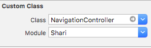

# Shari for Swift

[](https://github.com/Carthage/Carthage)
[](http://cocoapods.org/pods/Shari)
[](http://cocoapods.org/pods/Shari)
[](http://cocoapods.org/pods/Shari)

Shari is the alternative to the library of `UIPickerView` (drum roll) in Swift. You can select a item using `UITableView`.


## Requirements

- iOS 10.0+
- Xcode 9+
- Swift 4+

## CocoaPods

Shari is available through [CocoaPods](http://cocoapods.org). To install
it, simply add the following line to your Podfile:


```ruby
pod "Shari"
```

Then, run the following code:

```ruby
$ pod install
```

## Carthage

[Carthage](https://github.com/Carthage/Carthage) is a decentralized dependency manager for Cocoa applications. 

``` bash
$ brew update
$ brew install carthage
```

To integrate Shari into your Xcode project using Carthage, specify it in your `Cartfile`:

``` ogdl
github "nakajijapan/Shari"
```

Then, run the following command to build the Shari framework:

``` bash
$ carthage update
```


## Usage

To run the example project, clone the repo, and run `pod install` from the Example directory first.

## ViewController

- UINavigationController

```swift
let modalNavigationController = storyboard!.instantiateViewController(withIdentifier: "ModalNavigationController") as! ShariNavigationController

modalNavigationController.parentNavigationController = navigationController
navigationController?.si.present(modalNavigationController)
```

- UITabBarController

```swift
let modalNavigationController = storyboard!.instantiateViewController(withIdentifier: "ModalNavigationController") as! ShariNavigationController

modalNavigationController.parentTabBarController = tabBarController
tabBarController?.si.present(modalNavigationController)
```


You can change background color using following code:

```swift
ShariSettings.backgroundColorOfOverlayView = UIColor.redColor()
```


You can change with following code whether view should transform scale down:

```swift
ShariSettings.shouldTransformScaleDown = true
```


## ModalViewController

- Create NavigationController and ViewController in storyboards.
- Input `Shari.NavigationController` in Custom Class for NavigationController.





### Closing a window

You can close using the following code in viewController:

```swift
let currentNavigationController = navigationController
currentNavigationController?.si.dismiss {
    // something
}
```


## Author

nakajijapan, pp.kupepo.gattyanmo@gmail.com

## License

Shari is available under the MIT license. See the LICENSE file for more info.
